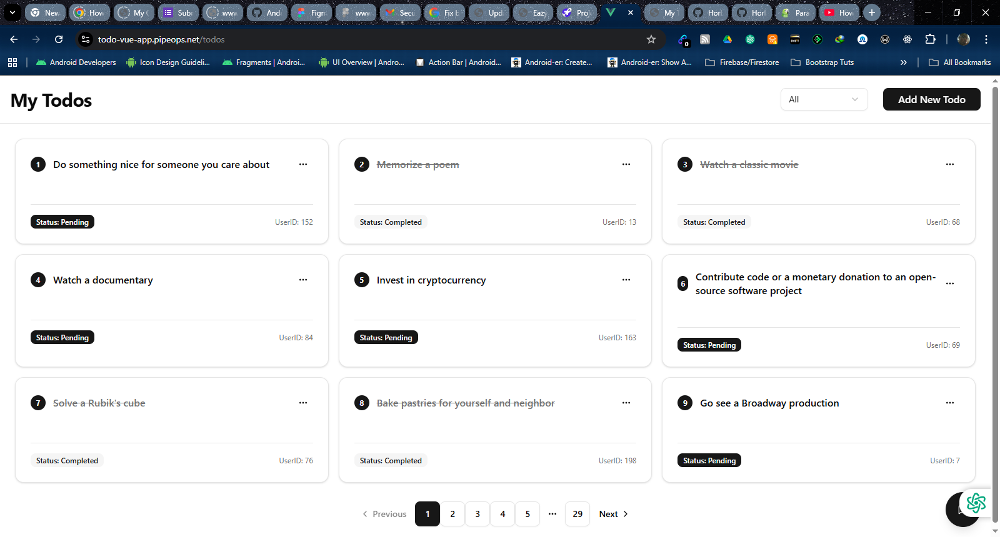
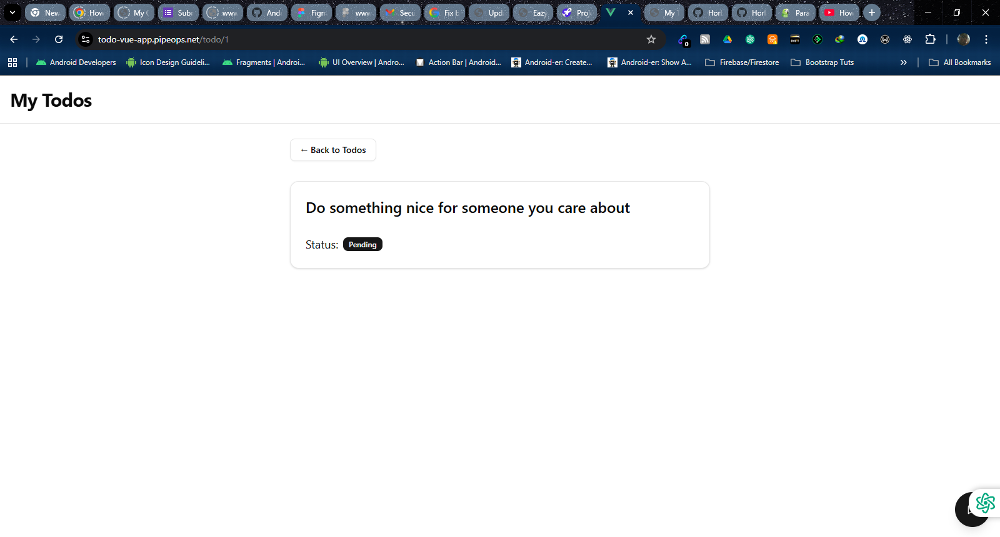

# 📝 Vue 3 Todo List App

This is a fully functional, accessible, and responsive Todo List app built with:

- ✅ Vue 3 + Vue Router
- ✅ Pinia for State Management
- ✅ JavaScript
- ✅ Tailwind CSS (with shadcn-vue for UI components)
- ✅ DummyJSON API
- ✅ Pusher for real-time chat

---

## 📦 Features

- View list of todos with pagination
- Filter todos by status (completed or pending)
- View full details of each todo
- Add, edit, and delete todos using modal dialogs
- Real-time chat widget with Pusher
- Accessible 404 page
- Keyboard-friendly navigation and focus styles
- Uses a fallback loading spinner for a smooth user experience

---

## 📂 Project Structure

```
my-vue-todo-app/
├── public/
├── src/
│   ├── assets/         # Global styles, images, and screenshots
│   ├── components/     # Reusable Vue components (TodoCard, Spinner, ChatWidget)
│   │   └── ui/         # shadcn-vue generated UI components (Button, Dialog, etc.)
│   ├── router/         # Vue Router configuration (index.ts)
│   ├── stores/         # Pinia stores for state management (todoStore.ts, chatStore.ts)
│   ├── views/          # Page-level components (TodoListView.vue, TodoDetailView.vue)
│   ├── App.vue         # Main application layout component
│   └── main.ts         # Application entry point (initializes Vue, Pinia, Router)
├── package.json  
├── .env.example        # Example environment variables for Pusher
├── tailwind.config.ts
├── postcss.config.js
├── vite.config.ts
└── README.md
```

---

## 📸 Screenshots

### 📋 Todo List View



### 📋 Todo List Mobile View


### ➕ Add Todo Modal


### 📋 Todo List Details



### ✏️ Edit Todo

!Edit Modal

### ❌ Delete Todo

!Delete Todo Modal

### 🚫 404 Page

!404 Page

---
## 🚀 Getting Started

```bash
git clone https://github.com/your-username/my-vue-todo-app.git
cd my-vue-todo-app
npm install
npm run dev
```
---

## Build

npm run build

---

## 🛠 API Integration

### 📡 API Used: [DummyJSON](https://dummyjson.com/)

The [DummyJSON](https://dummyjson.com/) API, a **free MOCK** API for testing purposes, was used in this project for its data structure, support and persistent mutations for `POST`, `PUT`, and `DELETE` operations on todos.

### ✅ API Features Used

- `GET /todos` — to fetch the full list of todos  
- `GET /todos/:id` — to fetch a single todo by ID  
- `POST /todos/add` — to add a new todo  
- `PUT /todos/:id` — to update an existing todo  
- `DELETE /todos/:id` — to delete a todo

---

## 🧩 Challenges Faced During Development

### 1. Tailwind CSS And ShadCN Integration Issues
- Initially encountered failure while running `npx tailwindcss init -p`, on Tailwind CSS V4 and even after manually creating `tailwind.config.js` and `postcss.config.js`, styles like `bg-blue-500` did not apply. This also affected ShadCN being used in the project.
- ✅ **Resolution**: A new React project was created with Tailwind CSS Vite which doesn't require running the `npx tailwindcss init -p` command because V4 no longer makes uses of `tailwind.config.js` or `postcss.config.js`. ShadCN installation and integration went smoothly and the ShadCN documentation was used as a guide on how to integrate it in VueJs.


### 2. 404 Page Setup
- A fallback 404 page was required with an illustration and a way to guide the user back.
- ✅ **Resolution**: A `NotFoundView.vue` page was created, using an image, a descriptive message, and a ShadCN-styled “Back to Home” button.

### 3. New todos are created but can't be updated or deleted
- The DummyJSON API always one to create a new todo but won't allow one to either edit it or delete it. It was really impossible for such operations to be carried out. Several attempts to perform usch always led to an error 404 because the new todo **is not** actually saved on the API.
- ✅ **Resolution** From the DummyJSON API documentation, only the the todos which already exist on the mock API can be either edited or deleted. There's no room for such operations to be carried out on the newly created todo since the new todo isn't actually saved on the API. So we go with how the rules are written by only updating/deleting the already created todos found within the API.

### 4. Real-chat Capabilities
- Choosing the right and easy real-time chat capabilities for the app was a challenge. I needed to get one which would be easily integrated into the app without writing too much code.
- ✅ **Resolution**: I used [Pusher](https://www.pusher.com/), a realtime chat application in this project. I created an account at the webiste, I was given a dashboard which contained my API key, cluster, API secret key, etc which I'm to use to connect and use the servers at Pusher for chat. To make this work seamlessly, I also installed the pusher library by running `npm install pusherjs` and created a `chatStore.ts` file which would would be the logic behind the chats and a `ChatView.vue`, which is the frontend design of the chatbox.


###
---
